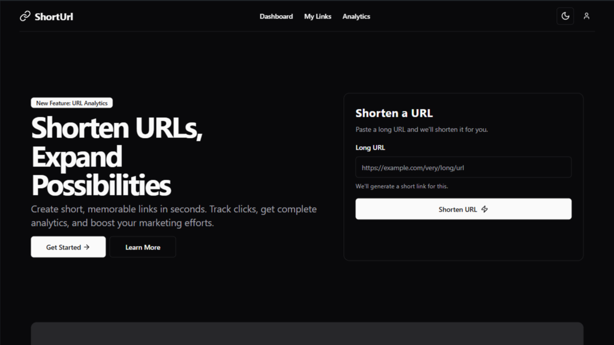

# 🔗 **ShortUrl**


ShortURL – A full-stack URL shortener built with Next.js, TypeScript, Express.js and mongoDB featuring user authentication, real-time analytics, and a clean, responsive UI using Tailwind CSS and shadcn/ui. Includes secure link management and visual insights with charts for enhanced user experience.


## ✨ Features

- **Authentication**: Secure sign-up and login with session-based access control  
- **Shortening**: Generate compact, HTTPS-secured short URLs in seconds  
- **Analytics Dashboard**: Real-time insights on clicks, devices, and referrers  
- **Data Visualization**: Track trends with bar charts powered by Recharts  
- **Link Management**: Enable/disable, delete, and manage user links  
- **Responsive UI**: Clean, accessible design using Tailwind CSS and shadcn/ui


## 📁 Project Structure

```
shorturl-frontend/
├── src/
│   ├── app/
│   ├── components/
│   ├── constants/
│   ├── context/
│   ├── hooks/
│   ├── lib/
│   ├── providers/
│   ├── schema/
│   ├── store/
│   └── types/
├── public/
├── package.json
└── README.md
```


## 📦 Installation

### 🛠️ **Prerequisites**
---

- Node.js (version 18 or higher)
- One of the following package managers:
  - **NPM** (comes with Node.js)
  - **PNPM** (`npm install -g pnpm`)
  - **Yarn** (`npm install -g yarn`)
  - **Bun** (`npm install -g bun`)

### 🚀 Getting Started
---

1. **Clone the Repository**

```bash
git clone https://github.com/dharmendra-007/shorturl-frontend.git
cd shorturl-frontend
```

2. **Install Dependencies**

```bash
npm install
```

3. **Environment Setup**

Create a `.env.local` file in the project root with the following variables:

```
NEXT_PUBLIC_BASE_URL = http://localhost:8000
```

👉**For BASE URL reference**, check the [Backend Repo](https://github.com/dharmendra-007/short-url-backend)

4. **Start the Server**

```bash
npm start
```

For development with hot reloading:

```bash
npm run dev
```

Open [http://localhost:3000](http://localhost:3000) with your browser to see the result.

similar steps for pnpm, yarn and bun.


## 🤝 Contributing

1. **Fork the repository**
2. **Create your feature branch**  
   `git checkout -b feature/YourFeatureName`
3. **Install dependencies** using your preferred package manager  
   `npm install` / `pnpm install` / `yarn install` / `bun install`
4. **Make your changes**
5. **Run the production build**  
   `npm run build` / `pnpm build` / `yarn build` / `bun build`
6. **Commit your changes**  
   `git commit -m "Add: Your meaningful message"`
7. **Push to the branch**  
   `git push origin feature/YourFeatureName`
8. **Create a Pull Request** from your branch to `main`


## 📄 License

This project is licensed under the MIT License - see the [LICENSE](LICENSE) file for details.

❤️ **Thank you for visiting!**
